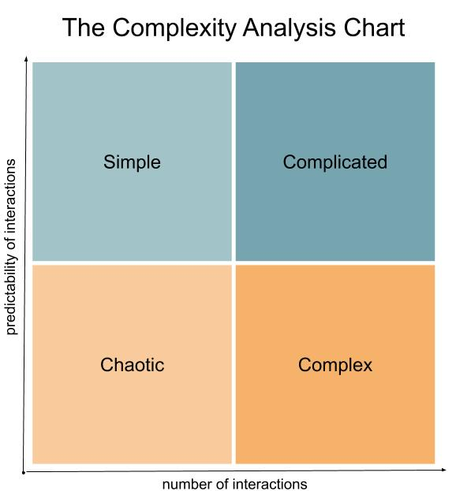

> “In dwelling, live close to the ground.  
> In thinking, keep to the simple.”  
> -- Lao Tzu (translated by Stephen Mitchell)

#The Question

The ideas of complexity and complication have arisen a surprising number of times in my reading and conversations recently. As such, I ended up with a question that I did not have a satisfactory answer to.

**What is the difference between complex and complicated?**

I spent quite some time researching this. There is a lot more nuance to it than I had at first anticipated. It forced me to think about the definitions of two other words that I do not find myself using as often: **chaotic, and simple**.

#The Answer

The issue is [linguistic](https://english.stackexchange.com/questions/10459/what-is-the-difference-between-complicated-and-complex), and as such can end up in a quagmire of interpretation which I usually avoid. But, it maintained my attention because there is a place for discussing the complexity of systems and problems in my day-to-day work as a developer. As such, here is a distillation of a useful framework that stems from the emerging field of [complexity science](https://www.uvic.ca/research/groups/cphfri/assets/docs/Complexity_Science_in_Brief.pdf):

**Complex -- having a large number of unpredictable interactions.  
Complicated -- having a large number of predictable interactions.**

This answer must be contextualized by the type of problem or system being analyzed. For example, two hundred predictably interacting cells may form a simple biological system while the same number of SQL queries may constitute a complicated relationship between an app and a database. But, the language for describing complexity can remain the same across the contexts.

#The Application

As far as software is concerned, Tim Peters hit the nail on the head:

> “Simple is better than complex.  
> Complex is better than complicated.”  
> -- Tim Peters in *[The Zen of Python](https://www.python.org/dev/peps/pep-0020/)*

##Simplicity

Simple software systems are predictable and, because of the low number of interactions, naturally extensible. This is almost always the best path forward when crafting software. Counterintuitively, this is not always the quickest way forward. I find that it is often easier to make complicated software systems than it is to make simple ones.

This phenomenon has two sources. The primary being that of the potential number of ways to do any task with code, there are more complicated ways than simple ones. As such, you are statistically more likely to arrive at a solution that requires more interactions than fewer. The secondary being the tendency of developers to over-engineer.

Iteration is the key to fighting both sources. When you compare multiple potential solutions, it is easier to find one that requires fewer interactions. When you practice over and over again, you will begin to let go of the desire to over-engineer the solution.

##Complexity

Complexity, by definition, is about unpredictability. In the realm of software, everything boils down to glorified if-then statements. As such, can one even make complex software?

I have come to believe that complexity in software directly rises from resilience to change. If you think of a very complicated piece of software, often you will realize that it fails when the conditions are not exactly as expected. Therefore, the complicated piece of software only has one purpose. Humans must learn to understand the constraints of the software instead of the software itself understanding the constraints of humans.

Complex software would handle being used for multiple purposes and would find graceful paths forward even when the inputs and constraints are not exactly as expected. The fields of [machine learning](https://en.wikipedia.org/wiki/Machine_learning) and [natural language processing](https://en.wikipedia.org/wiki/Natural_language_processing) have a lot of underlying complex problems. It is most likely from these fields that truly complex software systems will arise.

Most developers do not work in these fields. But, even when building standard websites and applications, there is the potential for developers to infuse a bit of complexity. Think of the typos and misclicks that users might make. Think of the possibility that this code will be moved into another application, or that the application itself will change over time. Code for those situations, while making as few assumptions as possible. The trick is thinking this way without again falling into the realm of complication and over-engineering.

When at all possible, keep to the simple.