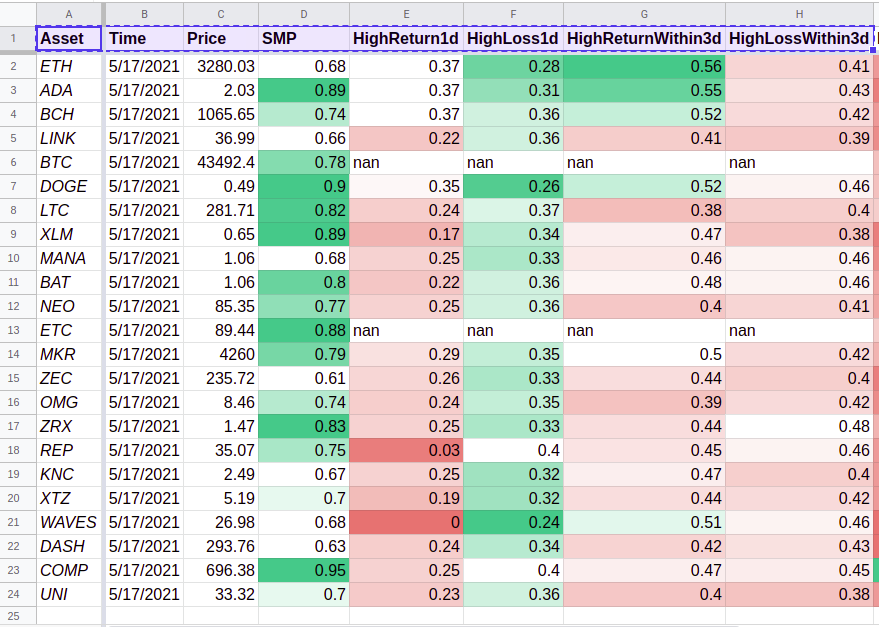
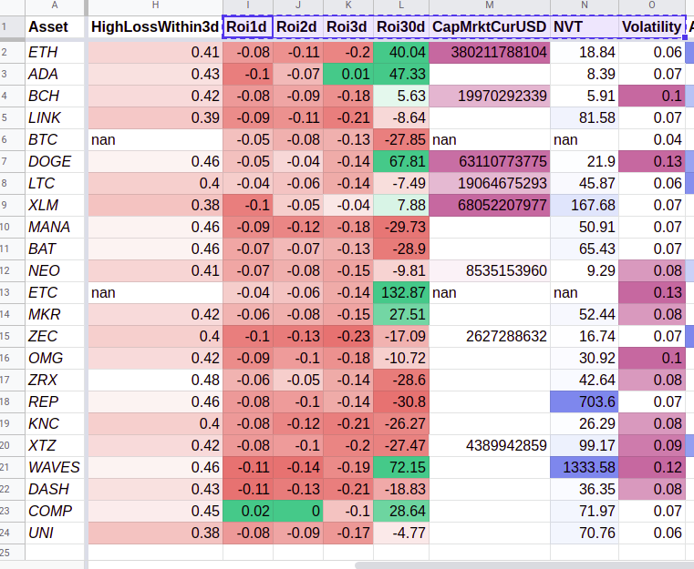
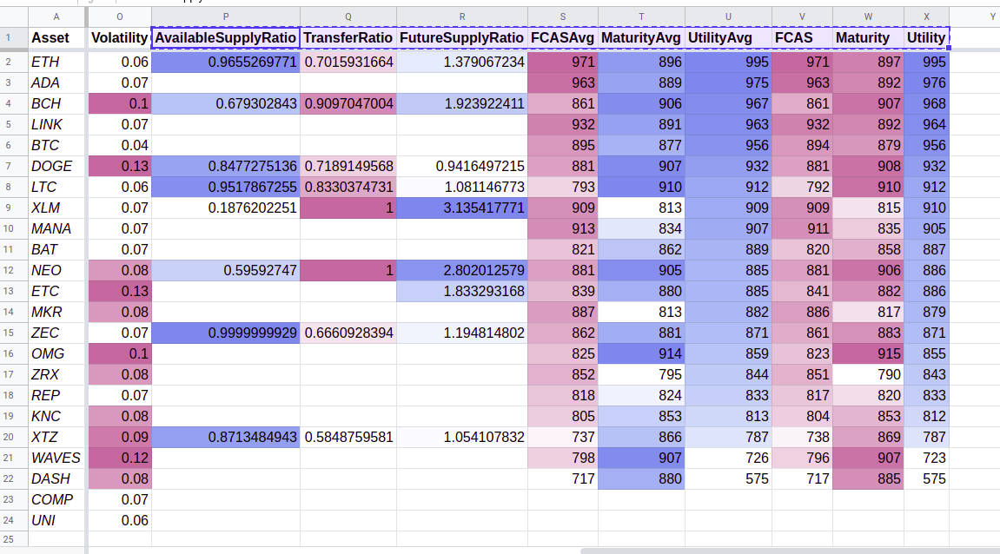

> "Data, I think, is one of the most powerful mechanisms for telling stories. I take a huge pile of data and I try to get it to tell stories." - Steven Levitt

# Credits

I want to start by giving credit to two amazing companies:

- [Coin Metrics](https://coinmetrics.io/)
- [Flipside Crypto](https://www.flipsidecrypto.com/)

Both of which have publicly available APIs that include historical data. These provide an awesome resource for technical analysis and building predictive models. Their freemium models contribute greatly to the open source and distributed technology culture that cryptocurrency is meant to foster.

# The Metrics

These metrics are all from my own daily analysis that I run, which can be found at my [Patreon](https://www.patreon.com/isaiahnixon).

## Section 1

These are the main metrics that I use to decide how to invest each day.

- **Price:** Crypto markets are open for trading 24/7 so a snapshot price like this is only moderately useful at a glance, but it feeds into other more useful metrics.
- **SMP:** This stands for (Sideways Market Percentage) and is a metric that I developed to measure how an asset's price has moved over the past three days relative to it's longer term  volatility. This is a good indicator of whether or not a high-frequency trading (HFT) algorithm will be effective on this asset, as many HFT strategies require the asset market to be moving relatively sideways.

- **HighReturn1d:** This is a predicted probability that the asset will have a high (3% or greater) return on investment in 24 hours.
- **HighLoss1d:** This is a predicted probability that the asset will have a high loss on investment in 24 hours.
- **HighReturnWithin3d:** This is a predicted probability that the asset will have a high return on investment sometime within 3 days. One note on this, is that the predictive algorithm is not looking for that growth at the three day mark precisely, but anywhere in the time range. This is why the this metric and HighLossWithin3d can both be relatively high. In such a case, the algorithm is predicting both high gains and losses within the same timeframe.
- **HighLossWithin3d:** This is a predicted probability that the asset will have a high loss on investment sometime within 3 days.

*Note:* If you see "nan" in any cell that simply means some source information for that metric was missing.

## Section 2

- **Roi1d:** The ratio of this price snapshot to the one from 1 day ago.
- **Roi2d:** The ratio of this price snapshot to the one from 2 days ago.
- **Roi3d:** The ratio of this price snapshot to the one from 3 days ago.
- **Roi30d:** The ratio of this price snapshot to the one from 30 days ago.
- **CapMrktCurUSD:** The current market cap of the asset in USD. Calculated by multiplying the circulating supply by the price.
- **NVT:** This stands for Network Value-to-Transaction and is calculated by dividing the market cap by the transaction volume. It is a very useful metric for determining how saturated the market for an asset is. An exceptionally high NVT is often considered a sign of an asset being over-valued.
- **Volatility:** This is the average volatility of the asset price over the past 30 days. In my experience assets with very low volatility can be difficult to find good HFT strategies for, and assets with very high volatility carry exceptional risk.

## Section 3

- **AvailableSupplyRatio:** - The ratio of the current supply that is readily available. This is calculated based on [Free Float Supply](https://coinmetrics.io/introducing-free-float-supply/).
- **TransferRatio:** The ratio of daily transfers to active accounts. This is a good measure of market liquidity.
- **FutureSupplyRatio:** The ratio of the current supply to the expected future supply. This is a high-level way of deteriming whether a market will be growing or shrinking over time.

The final six metrics on the chart are directly from [Flipside Crypto Public API - V2](https://api-docs-v2.flipsidecrypto.com/#intro) and more information about them can be found there. I don't currently use any of this data to feed my predictive models. But, I like viewing the metrics as a way to double check my ratings against another system of analysis. Also, I have had good luck using these metrics to decide bewteen assets with similarities in other metrics.

# A Living System

I am constantly working to improve my models, data pipeline, and analytical skills. As such, these are just the metrics I use currently. However, hopefully this breakdown will prove useful for you when making your own analysis and investments.
