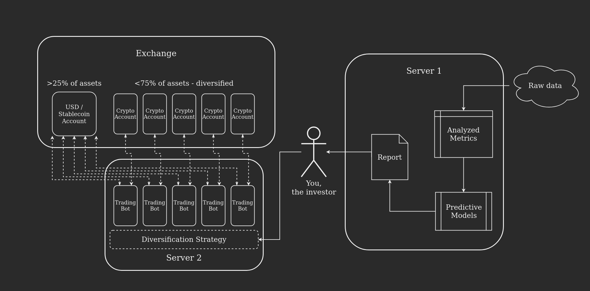

> KEEP CALM and TRUST THE MODEL

# Disclaimer

This is not a get-rich-quick scheme. The cryptocurrency markets are an untamed beast, and any investments you make in them are a definite risk. Only use disposable money for this purpose. This system has been very profitable for me, but I cannot guarantee future profits of any kind.

# The System

At a high-level, this is the system I have devised for making steady profits on a crypto investment portfolio.

There are four modules:

- **Server 1:** Generate reports
- **Investor:** Choose assets and ratios
- **Server 2:** Run trading bots
- **Exchange:** Host accounts and process orders

You can replace any of the modules with various alternatives without disrupting the whole. Also, in theory, this system should work well for assets of any kind that can be exchanged by a bot and for which raw data is available.

# The Breakdown

Here are some details on how I have set up each of my modules.

## Server 1: Generate Reports

I have a [Python](https://www.python.org/) script that scrapes public APIs on cryptocurrency data each day, combines the data from different sources, and then processes it into consumable format.

From there, the scripts runs the data through different [TensorFlow](https://www.tensorflow.org/) models. There are seperate models for predictions on each timescale and for assets with different available datapoints. These models are already trained with historical data on the specific assets which can fit in with my other modules.

The model predictions, and the processed data are combined into a report. I plug this data into a spreadsheet which color codes everything and just generally makes it easier for a human to digest. And finally, I upload this report to my [Patreon](https://www.patreon.com/isaiahnixon) (shameless plug).

## Investor: Choose Assets and Ratios

I keep rigorous track of how different assets have performed over time in my profit system. And I use this knowledge, the raw data from the report, and whatever rumors are circulating through various news channels to form some general opinions of which assets are currently viable investments.

I take these opinions, and the model predictions from the report and weigh the relative value of different assets in my mind. I try hard to find the places where my opinions and the models agree that profits are to be made, and to avoid places where one or the other predicts losses.

Generally, I shoot for at least 5 assets at a time in my portfolio. And I keep a very even spread between them. I make small tweaks here and there, but this rule of thumb has served me well.

## Server 2: Run Trading Bots

For each of the assets in my portfolio, I run a [Hummingbot](https://hummingbot.io/) which handles high frequency trading between that asset and my USD account on the exchange. I have various strategies that I have developed for these bots, and in general have found them to be quite impressive. There is a lot of freedom within the system, especially when running Python [scripts alongside the strategies](https://docs.hummingbot.io/scripts/overview/).

## Exchange: Host Accounts and Process Orders

For my exchange, I chose [Binance US](https://www.binance.us). There are pros and cons to all of the major exchanges, so it was a tough choice. But here were my reasons:

- Pre-built Hummingbot connector.
- Discounted trading fees when you use BNB to pay them.
- Direct crypto to USD trading, which seems a steadier option than using a stablecoin.
- Simple bank connector for moving money in and out.

# The Future

This is a living and breathing system. I am constantly updating my scripts, models, and strategies. But, I have found that this way of managing my portfolio has led to consistent and steady profit, even in a generally volatile market. I hope this information helps some of you who are trying to accomplish the same. If you want deeper information, or to follow along with the updates to my system please check out my [Patreon](https://www.patreon.com/isaiahnixon).