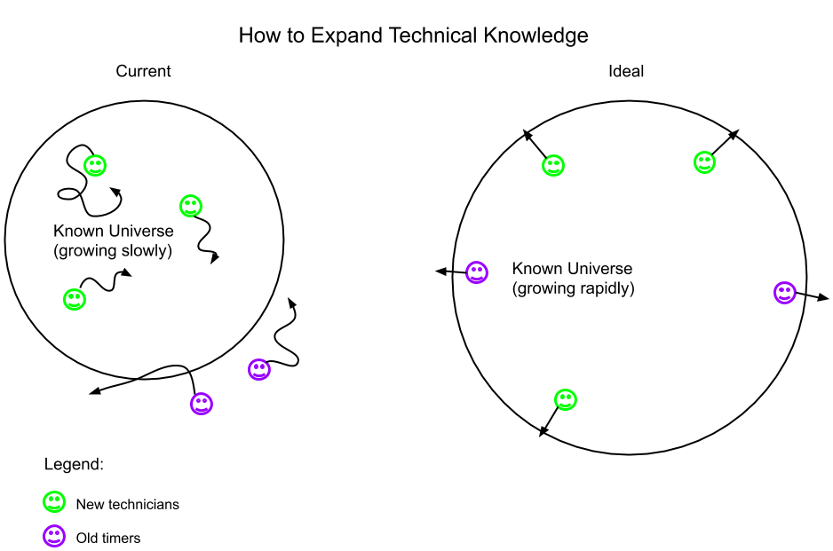

> “The solutions all are simple... after you have arrived at them. But they're simple only when you know already what they are.” - Robert Pirsig, Zen and the Art of Motorcycle Maintenance

I have been reading through [*Zen and the Art of Motorcycle Maintenance*](https://en.wikipedia.org/wiki/Zen_and_the_Art_of_Motorcycle_Maintenance) lately. It's got me thinking a lot about how to get better as a technician and how to make technology better along the way. If you have not read this book before, I recommend it. If you have, this post is not an attempt to build on that amazing body of work. What follows are some lateral observations I have made as I was pondering some of the ideas in the novel.

#The Problem

There are two common misconceptions that bother me:

1. **Because a problem has been solved before, it is part of the known universe.**

2. **Solutions to problems from the past will solve problems in the future.**

These may not seem related on the surface, but they are two sides of the same coin. Once unpacked, these misconceptions also present a clear path forward to solving many of the problems that they create.

The first assumption is related to the idea of [tribal knowledge](https://www.isixsigma.com/dictionary/tribal-knowledge/), but in a larger sense than knowledge stored within a specific company. The assumption here is that once something has been done in the technology field, in general, anyone can build upon it. This is false.
Most of the technical knowledge built over time has belonged to private individuals and/or companies. These entities want to keep that knowledge for themselves as a competitive advantage. This is the most natural mindset in the world, but is problematic at scale. In the grand scheme of things, the mindset is like slamming the brakes on the car of technical progress while also applying the gas. You’re just burning rubber.

The second assumption relates to the way new technicians are trained, and the models they follow to become better at their craft. Often, people are handed solutions to known problems and told to study them. Or even worse, finished products that are running fine, and a manual on how they should run. This is less than half of what you need to know to ever hope to solve new problems or create new products. Most of the work that was done in finding those solutions and making those products was probably never documented. Because: Why teach people what didn’t work? And why document what you choose not to do? Thus, most of the knowledge needed to apply the skills the technicians who created the solution or product applied is not passed down.

#The Solution

The first part of the solution is to **document and catalog technical knowledge in a useful and centralized way**. I do not know exactly what this would look like, but there are projects out there that are already doing this in domain-specific manners. These are awesome projects, that I encourage people to contribute to. Contributions to these are critically important to building out the known universe. The more people contribute, the less progress is hindered by arbitrary knowledge barriers. [Open Source Guides](https://opensource.guide/) is a great place to get started.

This solution has a flip side. If we're not careful, it feeds into the problem of the second dangerous assumption. The more that is known, the more people will try and learn that which is known as a method of becoming a better technician. This is not inherently a bad pursuit, but it is an incomplete path.

What needs to happen, is as the known universe grows, we need to **enable beginners to start at the harder and harder problems**. This is counterintuitive at first because it forces them in frustrating and difficult circumstances. But, it is exactly those circumstances that make people better technicians. As they find these solutions, the new technicians are becoming a part of the process of growing the known universe. Therefore, they are building the skills that allow them to erase the problems of the first dangerous assumption.

If this model is adopted widely, no longer is there the constant struggle of poor documentation and a lack of adequate training. Instead, the momentum of the rising prominence of technology will empower a flywheel effect. This is a field where the workers themselves need to look at the bigger picture. Together, we can scale this beyond anything we’re working on right now. The big open source projects, and the small ones, are proving time and again that this is a model that will add jet fuel to human innovation and progress.

Not to mention, the part that is really important to the individual. **This model will rocket your career, and make you better at your craft.** Not just give you more arbitrary knowledge, but truly make you better. This is the goal that led me down this path of thought in the first place, and as such is the goal I will end with.
