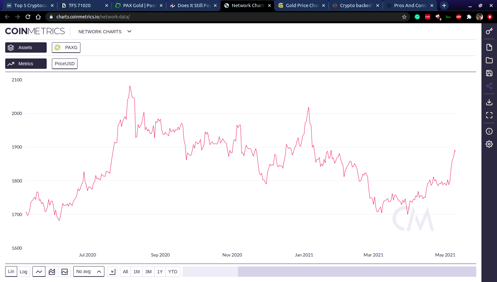

> How two very different types of investments can become one stabilizing portfolio factor.

# Disclaimer

This is not a get-rich-quick scheme. The cryptocurrency markets are an untamed beast, and any investments you make in them are a definite risk.

# PAXG

The [PAX Gold token](https://www.paxos.com/paxgold/) (PAXG) is a cryptocurrency that is backed 1:1 by ounces of gold in an actual vault. This makes it a [stablecoin](https://en.wikipedia.org/wiki/Stablecoin). Normally, I would not invest in stablecoins for any reason other than to participate in crypto to crypto markets which I cannot trade in otherwise. However, gold is a whole different animal than the US Dollar (which is what backs the most popular stablecoins).

A quick comparison of the last year of actual gold prices and the last year of PAXG's price demonstrate that the tethering of the system is working quite well:

Source: [goldprice.org](https://goldprice.org/gold-price-chart.html)

Source: [coinmetrics.io](https://charts.coinmetrics.io/network-data/)

# Is gold still relevant?

This is the question I was asking myself as I debated the inclusion of PAXG in my portfolio. Gold is only valuable because it is valued by people. There is no major practical use for it. But by the same logic, most tradable assets are valuable to the investor only because of their value to people. An investment portfolio is built for projected value of the assets over time, not the practicality of them.

Here is a chart of the price of gold for the past 20 years:

Source: [goldprice.org](https://goldprice.org/gold-price-chart.html)

As you can see, this is definitely a slow climb, with long periods of downtrend. But this is a chart of the [S&P 500](https://en.wikipedia.org/wiki/S%26P_500) for the same time period:

Source: [macrotrends.net](https://www.macrotrends.net/2324/sp-500-historical-chart-data)

The peaks and troughs of the charts are in completely different places. Which to me, is the biggest advantage of adding gold (via PAXG) to a portfolio, even one built on cryptocurrency. The investment provides stability through diversification, even if there are no guaranteed returns from the value of the gold itself.

# Gold vs Crypto

As the crypto market is very young, there's no fair long-term comparison between investing in crypto and gold. But, here's a chart that I think demonstrates the relative stability of PAXG compared with a more traditional crypto asset:

(In this chart PAXG is the red line and ETH is the green.)
Source: [coinmetrics.io](https://charts.coinmetrics.io/network-data/)

In a lot of ways the idea of a high-tech distributed blockchain currency, and metal sitting in a very-centralized vault could not be more at odds with one another. But, in one important way they are the same: they are all about stability.

# Conclusion

I am going to be moving 10% of my portfolio into PAXG with the intention of [HODLING](https://www.investopedia.com/terms/h/hodl.asp). Only time will tell the true payoff of this move, but as best I can tell, it should act as a partial value anchor even when the overall crypto markets are moving up and down.