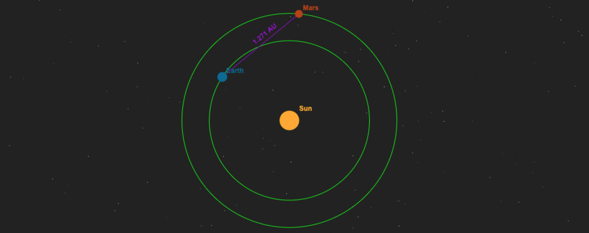

> This is a cross post from [DEV Community](https://dev.to). Original URL: https://dev.to/isaiahnixon5/how-to-make-a-dynamic-animated-responsive-canvas-element-3kb3



When creating [Where is Mars?](https://where-is-mars.isaiahnixon.com/) I had data that I needed a visual representation of. I knew `<canvas>` was the answer. But, I didn't quite know how to get it there. It took a bit of research and trial-and-error but I made it work. I figured this could help someone else, so I thought I would share it here.

# The Responsive Canvas

First, we need a canvas element.
```html
    <canvas id="responsive-canvas"></canvas>
```
For me, CSS is the easiest way to place and size the canvas how I want.
```css
    canvas#responsive-canvas {
      width: 100%;
      height: 100%;
      position: fixed;
      left: 0;
      top: 0;
      z-index: -1;
    }
```
Finally, we need a couple of JS variables to interact with this component.
```js
    const c = document.getElementById("responsive-canvas");
    const ctx = c.getContext("2d");
```
# Feed the Canvas its Own Size

The canvas size is controlled by CSS. As such, the context in JS doesn't know where to draw things. Run this function each time before drawing anything on the context:
```js
    const setUpCanvas = () => {
    	// Feed the size back to the canvas.
        c.width = c.clientWidth;
        c.height = c.clientHeight;
    };
```
# Draw on the Canvas in Ratios

Whenever making a responsive canvas drawing, everything must be done in ratios. As such, it is important to know the minimum value between the width and the height:
```js
    const min = Math.min(c.height, c.width);
```
This can be used to draw components that have the same relative size, no matter the screen. For example:
```js
    ctx.fillStyle = "#FFAA1D";
    ctx.beginPath();
    ctx.arc((c.width/2), (c.height/2), (min * 0.04), 0, 2 * Math.PI);
    ctx.fill();
```
# Tie the Drawing to Window Resize

The code for drawing components on the canvas should be wrapped in a function:
```js
    const drawComponents = () => {
    	/* Code for drawing on the canvas */
    };
```
This function, along with `setUpCanvas()` from the previous section should be called whenever the window is resized. You'll end up with something like this:
```js
    window.addEventListener('resize', () => {
    	// Clear the canvas.
    	ctx.clearRect(0, 0, c.width, c.height);
    
    	// Draw it all again.
    	setUpCanvas();
    	drawComponents();
    });
```
# Animate Through Intervals

If you want to do any animations with the components, you will need your `drawComponents()` function to return the output of a `setInterval()` function. This will look something like this:
```js
    const drawComponents = () => {
    	/* Code for drawing on the canvas */
    
    	// Return the animation interval.
    	return setInterval(() => {
    		/* Code for changes to canvas over time. */
    	}, 100);
    };
```
Then you will want to capture this interval when `drawComponents()` is called and clear it away when the window is resized. Like so:
```js
    setUpCanvas();
    let animationInterval = drawComponents();
    
    window.addEventListener('resize', () => {
    	// Clear the canvas.
    	ctx.clearRect(0, 0, c.width, c.height);
    
    	// End the old animation.
    	clearInterval(animationInterval);
    
    	// Draw it all again.
    	setUpCanvas();
    	animationInterval = drawComponents();
    });
```
# Dynamically Update the Data

In my case, I also wanted the data that the canvas represented to be updated every minute. First, add the data as an input to `drawComponents():`
```js
    const drawComponents = (data) => {
    	/* Code for drawing on the canvas, based on data */
    
    	// Return the animation interval.
    	return setInterval(() => {
    		/* Code for changes to canvas over time. */
    	}, 100);
    };
```
Then, take the logic from the window resize event, and make a general `reset()` function that takes the new data object, and an animation interval as inputs.
```js
    const reset = (data, animationInterval) => {
    	// Clear the canvas.
    	ctx.clearRect(0, 0, c.width, c.height);
    
    	// End the old animation.
    	clearInterval(animationInterval);
    
    	// Draw it all again.
    	setUpCanvas();
    	return drawComponents(data);
    };
```
Finally, your code should look something like this:
```js
    setUpCanvas();
    let data = "";
    let animationInterval = drawComponents(data);
    
    setInterval(() => {
    	// Update data.
    	data = "cool new data";
    	animationInterval = reset(data, animationInterval);
    }, 60000);
    
    window.addEventListener('resize', () => {
    	animationInterval = reset(data, animationInterval);
    });
```

# Final Code
You can see how the final code all came together in [main.js](https://github.com/isaiahnixon/where-is-mars/blob/d375e9877b8c29c035b8843ef8a75d5aed2cc9f5/js/main.js).