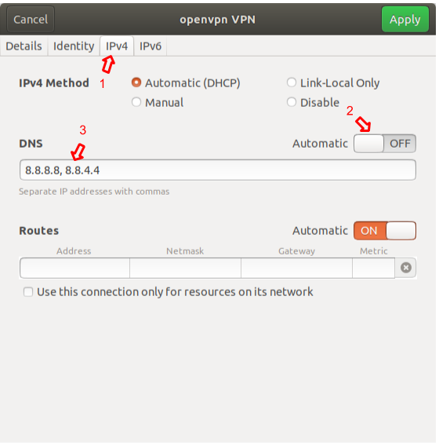

Outlined here are some easy (and often overlooked) steps, which can greatly increase the security and privacy of your Ubuntu 18.04 laptop.

##Encrypted Disk

**What:** Ubuntu 18.04 comes with built-in disk encryption.
During the installation, select the “Encrypt the new Ubuntu installation for security” option.


Credit: [mikewhatever](https://askubuntu.com/questions/1029285/ubuntu-18-04-disk-encryption/1029303#1029303) 


- On the next screen, you will be prompted to create a decryption [password](https://security.stackexchange.com/q/6095).
- Finish the installation, and the hard drive will be encrypted whenever the computer is powered off.
**Caveats:**
- If you need to dual boot, a more [advanced configuration is required](https://askubuntu.com/questions/1029285/ubuntu-18-04-disk-encryption).
- Make a habit of shutting your computer down whenever it is not in use, this will trigger the encryption process each time and lock in the security benefits.
**Why:** The physical security of a computer (especially a laptop) is impossible to guarantee, and I don’t want to stress about what files are on my drive at any given moment in time.

##Firewall

**What:** Ubuntu 18.04 comes with [Uncomplicated Firewall (UFW)](https://help.ubuntu.com/community/UFW).

- After installation, run this command from the terminal:

```
sudo ufw enable
```

- The firewall will now block all incoming requests and be enabled on startup by default.

**Caveat:** An unnerving number of programs assume certain ports are open on your machine, and troubleshooting those programs can sometimes take time.

**Why:** A comprehensive firewall puts you in charge of what requests can be made to your machine from the network.


##Virtual Private Network (VPN)

**What:** [OpenVPN](https://wiki.debian.org/OpenVPN) is an easy-to-use VPN client that works well with Ubuntu 18.04.

- Download a `.ovpn` file from your VPN provider.
	- If your provider does not offer this, follow their specific instructions for setting up an OpenVPN connection, or they may have a native Ubuntu/Debian client.
- After installation, run these commands from the terminal:

```
sudo apt install openvpn network-manager-openvpn
sudo apt install network-manager-openvpn-gnome
```

- Open Settings
- Navigate to “Network”
- Click the `+` icon to the right of the “VPN” heading
- Select “Import from file...”


Credit: [@thucnc](https://medium.com/@thucnc/openvpn-on-ubuntu-18-04-3295cabf114c)

- Click the “Add” button in the upper right-hand corner of the window to save the connection
- Now, whenever you enable the VPN, your traffic will be tunneled through your provider’s network.

**Caveats:**

- A VPN connection can slow down your internet speed.
- You must get in the habit of turning on your VPN with any networks you do not trust. You could also look into turning on VPN on unlock.

**Why:** A VPN is crucial to your right to control the data you leave behind, and on untrusted networks provides a necessary layer of security.

##Domain Name System (DNS)

**What:** Customize your DNS resolution servers.

- Open the settings for your VPN connection


- Select the “IPv4” tab
- Turn off the “Automatic” toggle underneath the “DNS” heading
Add IPs for [public DNS](https://www.techradar.com/news/best-dns-server) of your choice. I use Google’s (`8.8.8.8`, `8.8.4.4`).



- Select the “IPv6” tab
- Turn off the “Automatic” toggle underneath the “DNS” heading
- Add IPs for [public DNS](https://www.techradar.com/news/best-dns-server) of your choice. Again, I use Google’s (`2001:4860:4860::8888`, `2001:4860:4860::8844`).
- Click the “Apply” button in the upper right-hand corner of the window.
- Now, whenever you use your VPN, DNS will be handled by the service you chose.
**Why:** Knowing that you are actually on the sites you think you are, is fundamental to your security online. This also helps lock in the benefits of browsing with a VPN.

