# The Problem

You need somewhere centralized and human-readable to store data that you're processing or collecting with a Python script.


# The Solution

Use [Google Sheets](https://sheets.google.com) as free (or [very cheap](https://one.google.com/about/plans)) storage for even large quantites of data, and [Pandas DataFrames](https://pandas.pydata.org/docs/reference/api/pandas.DataFrame.html) to make the data easy to handle on the scripting side.

Yeah, that sounds like it would be a huge lift. But, I've distilled the setup and utilization down enough to make it quite easy to use.

## Requirements

 - [Google Account](https://console.cloud.google.com)
 - [Python 3](https://www.python.org/downloads/)
 - [gspread](https://pypi.org/project/gspread/)
 - [pandas](https://pypi.org/project/pandas/)

To install gspread and pandas on my setup, I used [pip](https://pip.pypa.io/en/stable/getting-started/).

```shell
pip3 install gspread
pip3 install pandas

```


## Step by Step

1. [Create a new project on Google Cloud.](https://console.cloud.google.com/projectcreate)

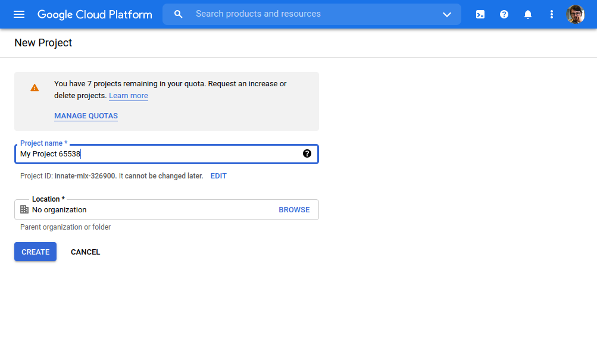

2. Access the `Service Accounts` page.

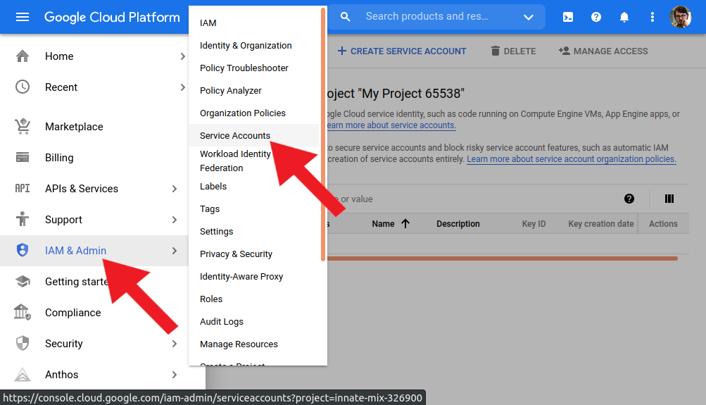

3. Create a new service account

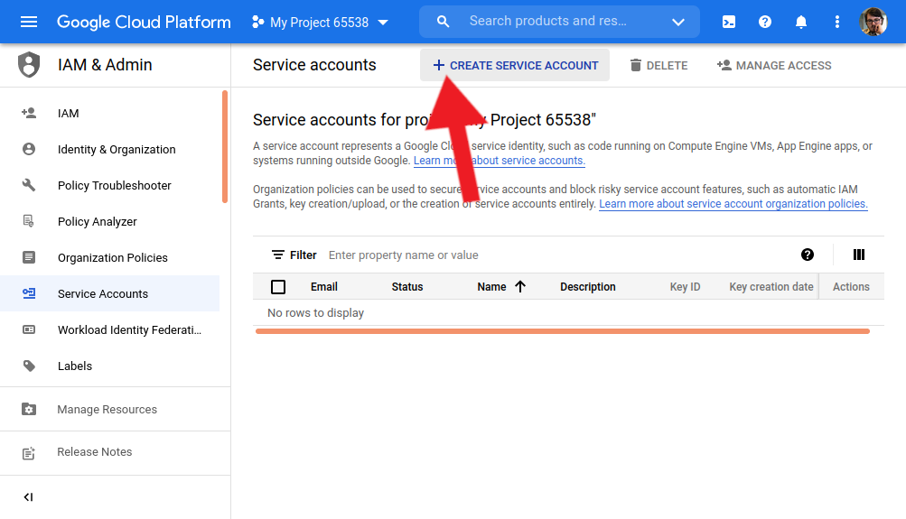

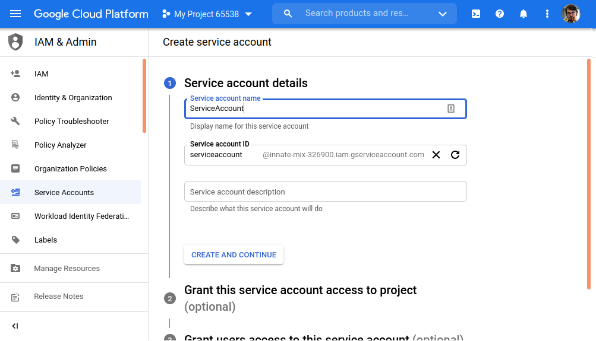

4. Create and download a key for the service account.


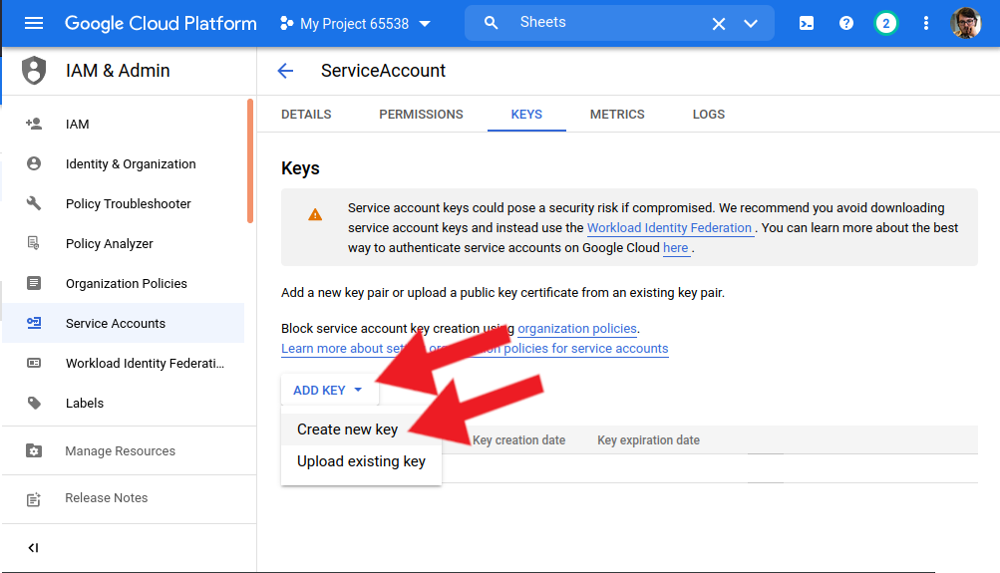

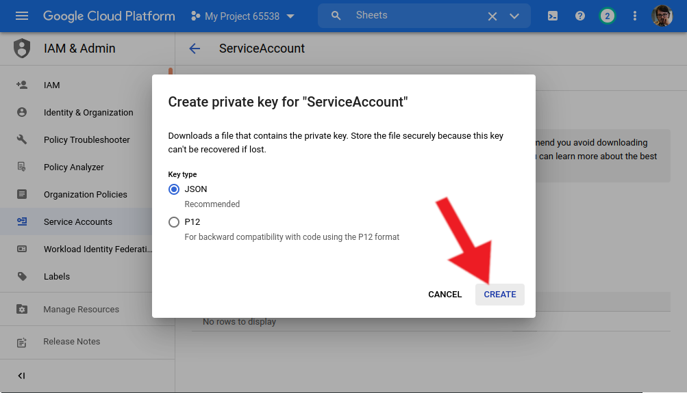

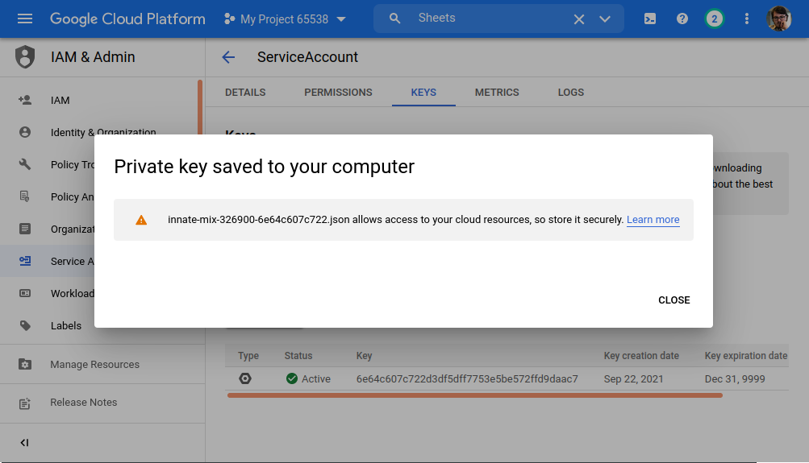

5. Copy the key to your Python project directory.

```shell
mv ~/Downloads/innate-mix-326900-6e64c607c722.json python-and-google-sheets/service_account.json

```

6. Back on the Google Cloud dashboard, enable the Google Sheets API.

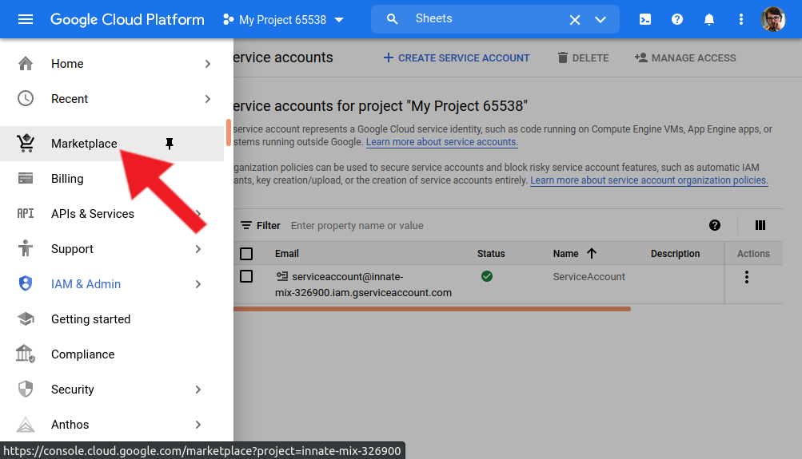

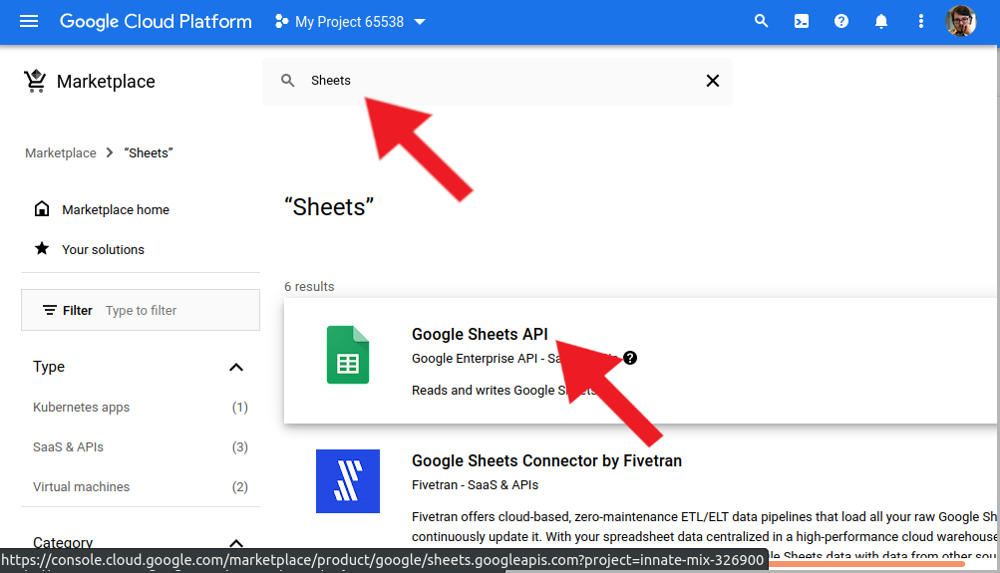

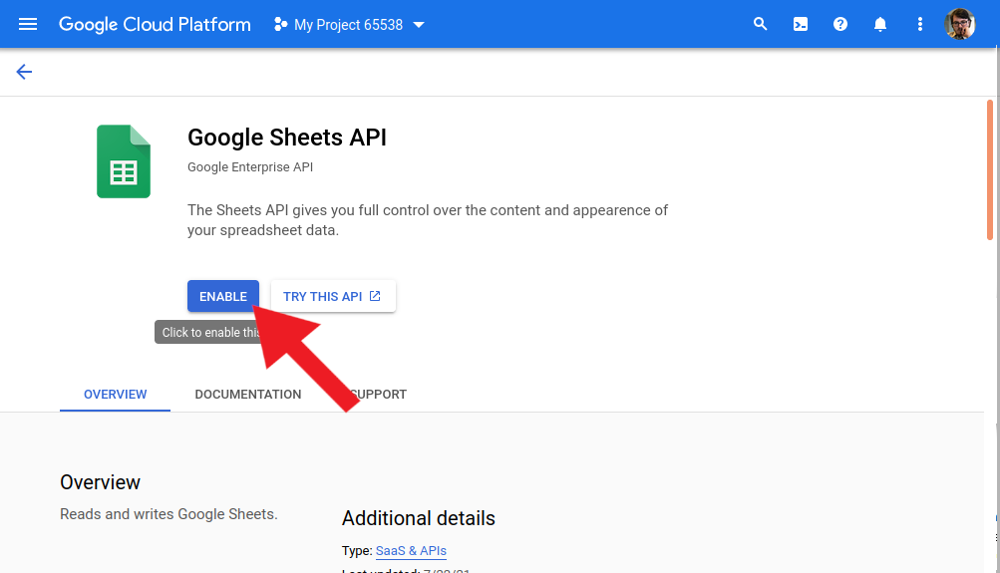

7. Open `service_account.json` and copy the client email.

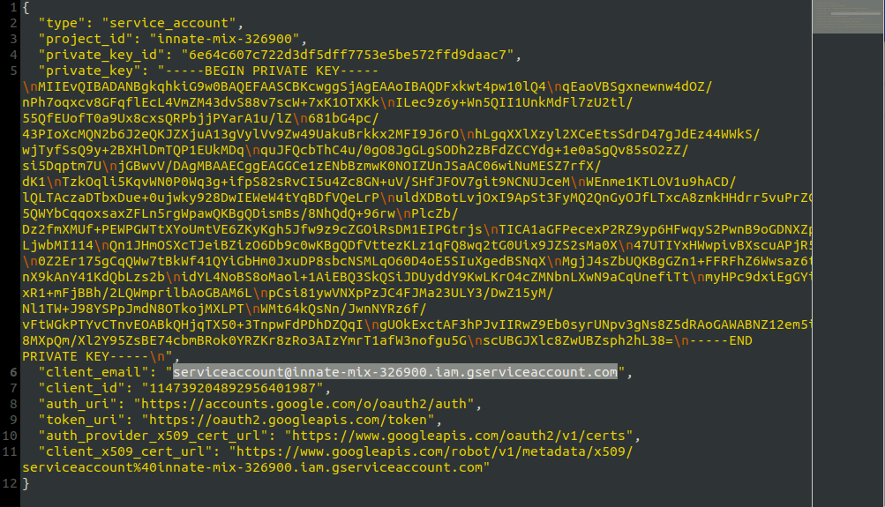

8. Open any Google Sheet that you want to use for this project, and share it with that email.

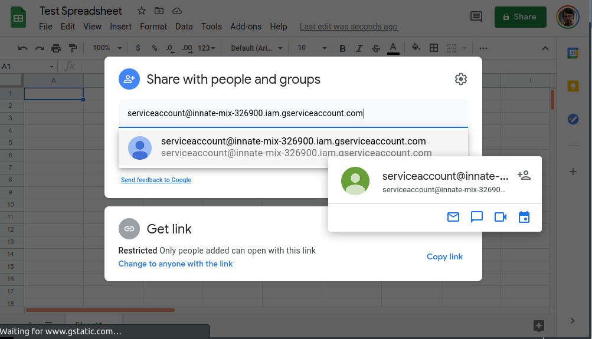

9. While you're in the Sheet, copy the key. The key is the middle part of the share link between `/d/` and `/edit`.


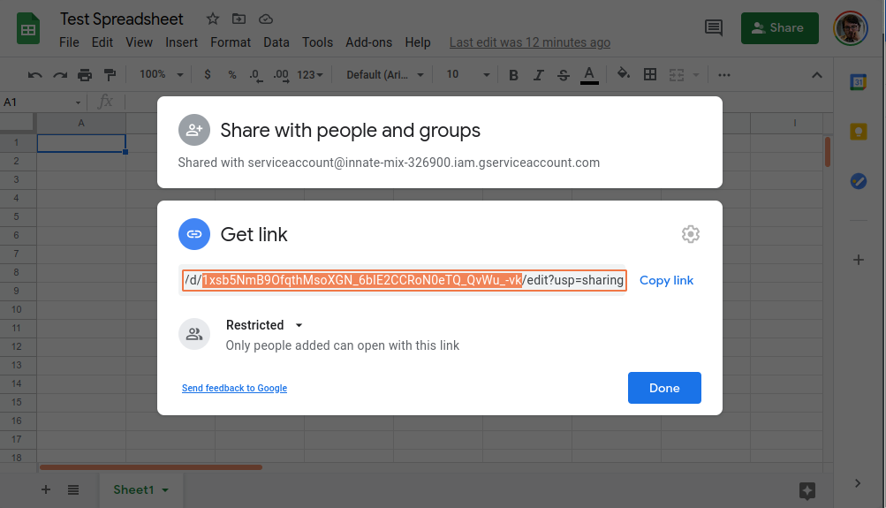


11. Create variables in your Python script to store this key and the ID of the worksheet.

```python
SHEET_KEY = '1xsb5NmB9OfqthMsoXGN_6bIE2CCRoN0eTQ_QvWu_-vk'
SHEET_ID = 0
```

*The ID of a worksheet is it's numerical order within the larger sheet, starting with 0.*

12. Download [google_sheets.py](https://gist.github.com/isaiahnixon/69719181a4d86612a5db8329229811a0) and move it into the same directory as your Python script.

13. From your script, import the methods defined in `google_sheets.py`.

```python
from google_sheets import get_sheet, set_sheet, clear_sheet, append_row_to_sheet

```
14. Now you can use these methods, passing `SHEET_KEY`, `SHEET_ID`, and then a DataFrame or series to add to a DataFrame. Here's an example implementation:


```python
import pandas as pd
from google_sheets import get_sheet, set_sheet, clear_sheet, append_row_to_sheet

SHEET_KEY = '1xsb5NmB9OfqthMsoXGN_6bIE2CCRoN0eTQ_QvWu_-vk'
SHEET_ID = 0

data = {'Name':['Tom', 'nick', 'krish', 'jack'],
        'Age':[20, 21, 19, 18]}
 
df = pd.DataFrame(data)

set_sheet(SHEET_KEY, SHEET_ID, df)

```

Run this script, and you can see the data appear on the Sheet.

```shell
python3 example.py

```

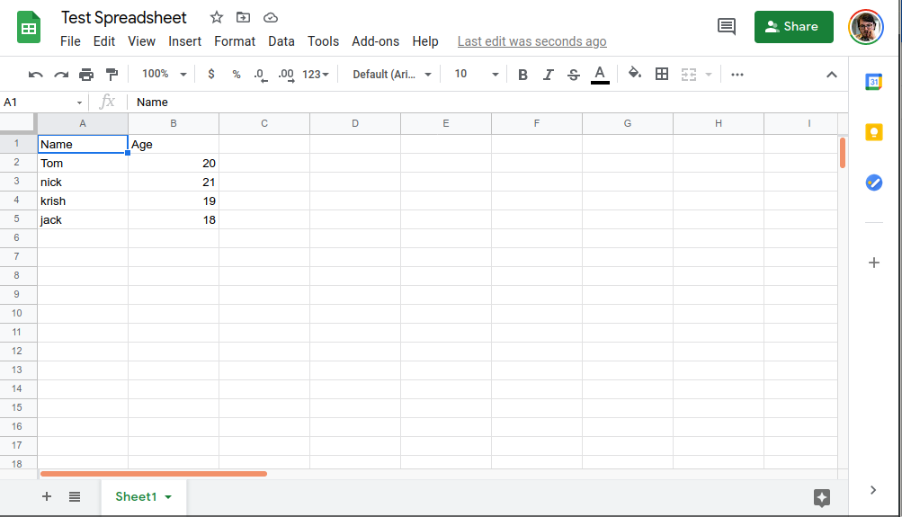


# Conclusion

With these basic methods, built on the [CRUD](https://en.wikipedia.org/wiki/Create,_read,_update_and_delete) model, you can work through almost any data storge need you might have. Plus, you have the added benefits of Google Sheets being cloud-based and human-readable by default. This easy setup and light Python module (29 lines of code total) together make up the most straightforward solution I could come up. I hope it can help you in your projects as well!  