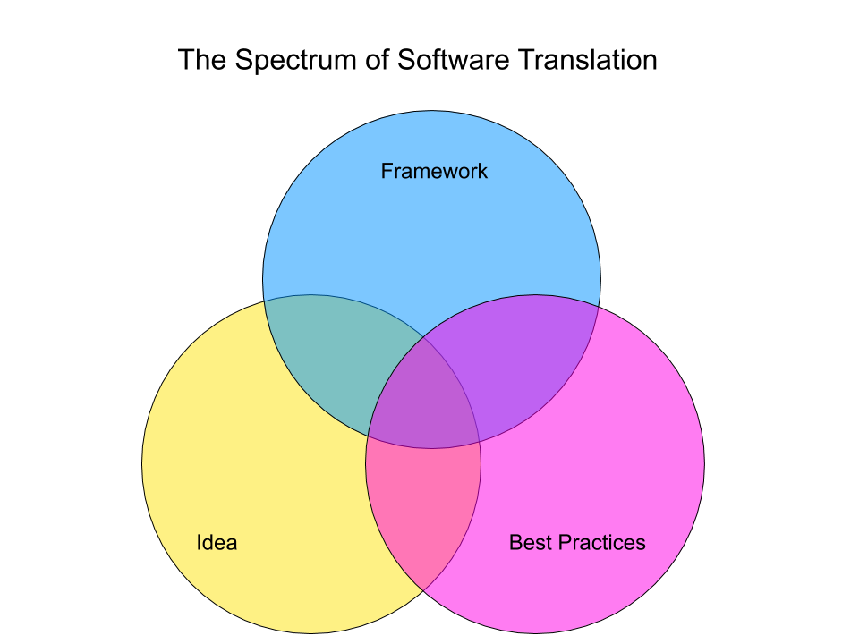

> Software is real-world translations of ideas. How could the process of this translation be more transparent?

## The Problem

**Consider the following scenario:**
An important person at a company (a product owner) comes up with an idea for a new function on a software application. This idea is just that, an idea. Through whatever process the company has for this stuff, the idea becomes a task for Developer. Developer then must translate the idea into software to complete this task. Let’s say, in theory, that this game of telephone does not work perfectly and the function, in the end, does not match the idea. Now, let’s accept that this is always the case because ideas are ideas and software is software. How does Developer know the idea? They don’t, they can only extrapolate from the requirements. How does the Idea Person know what decisions should be made in the translation process? They don’t, they can only idea, not develop, that’s why they are Idea Person.

This is a simplification of the struggle that software companies deal with all the time, and have come up with some clever solutions. The [agile methodology](https://agilemanifesto.org/), simple easy-to-use mockup tools (for Idea Person), and robust business processes run by trained analysts all come to mind. Yet, none of the tools I have seen in use, do a good job of making the translation process transparent between Developer and Idea Person. They often make ideas more clear to Developer and the feedback cycle smaller. But, they don’t strike at the heart of the problem.

**The process and decisions of translation are opaque to both Idea Person and Developer.**

## The Spectrum

When an idea is translated into software there are three major components of that translation:

### 1. The Idea

This is an abstract idea in the head of the person who made it. It is perfect and unsullied by reality. It is (importantly) not in the head of the translator.

### 2. The Framework

This is the framework in which the software is made. This can be anything from a very intricate and complex content management system (CMS) like [Drupal](https://www.drupal.org/) to the beautifully simple [Hypertext Markup Language (HTML)](https://developer.mozilla.org/en-US/docs/Web/HTML) itself. The important thing here is that the framework has a built-in way of doing things.

### 3. Best Practices

This is the collection of buzz-words that are important to the business this hour. Accessibility, performance, scalability, reliability, and so on to eternity. The important thing here is that there are standards that should be met that are agreed upon.

These components form a spectrum:

The translated idea (which I will now call the function) will land somewhere in the shaded regions between the circles. In which region, and even where in which region, the function lands can have huge impacts on the resources required for both development and maintainence. This is also a decision that developers can often make on their own. This is unfair to both parties involved.

Translation can so easily and so accidentally be insulting to the idea it is translating without ill intention. As such, developers can end up the bearers of bad news and even, in some scenarios, the opponent of Idea Person. I think this simple tool will make a big difference in those situations. Developer and Idea Person are not opposed to each other on this chart. They are balancing each other in a way that is meant to make functional software.

## The Solution

If, as part of the task creation process, Developer and Idea Person could sit down and fill in this chart together, they could decide what region to shoot for ahead of time. The act alone of outlining the requirements, the needed best practices, and the relevant aspects of the framework can reveal things to both parties that are otherwise opaque. It is important here, that this is a spectrum and not a list. This chart assumes that aspects of each circle are of varying relevance and importance. This process empowers Developer to present shades of the idea that bring the function closer to the framework or the best practices. It will also allow Idea Person’s idea to be sullied by the harsh truth of reality in a way that is not insulting. In the end, this should result in a more understanding team, a smoother development process, and better software.

